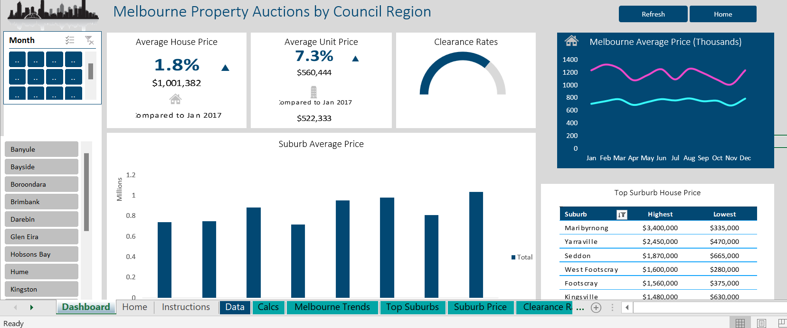

# MelbournePropertyAuction

## INTRODUCTION
This is a dashboard that shows the key metrics for a selected Council Region and Month in Melbourne Property Auctions 2018 Database. 

## Data Visualization
The dashboard is dynamic, it has two slicers that allows the users to filter:
a. The different months
b. The different cities in Victoria, Austrailia.

# This dashboard shows the:
1. Average House Price
2. Average Unit Price
3. Clearance rates
4. Surburban Average Price of the cities in Victoria, Austrailia.
5. Melbourne Average Price(House vs Unit); Static Chart.
6. Top Surburban House Price

## The Dashboard enables users to refresh the data and Pivot Tables.

 

